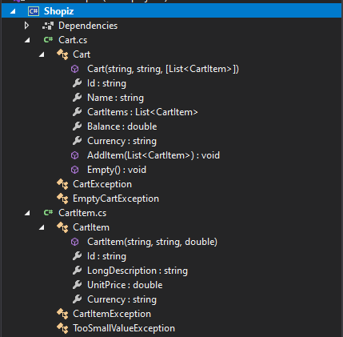
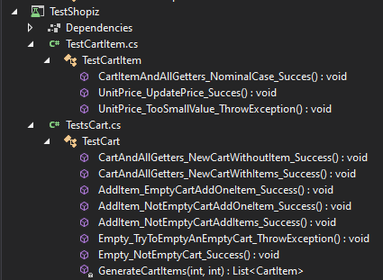
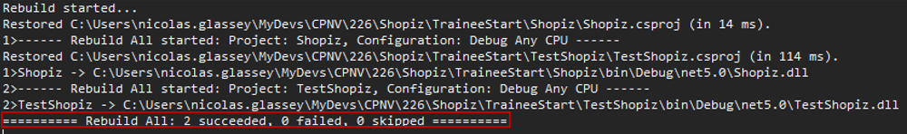
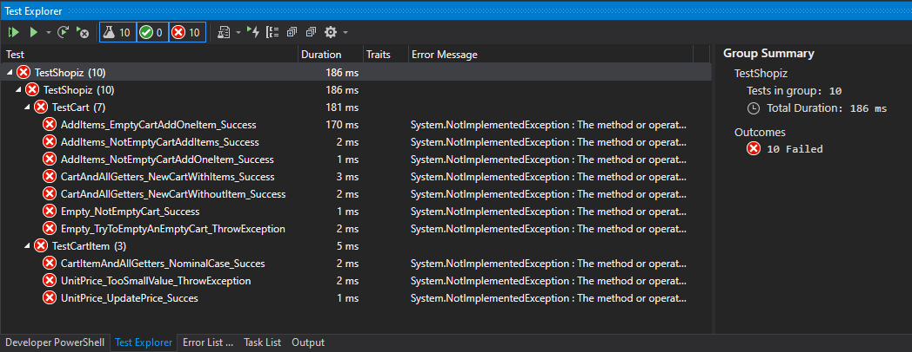

# 226a - POO sans héritage - Evaluation TDD

---
## Sujet à traiter
Vous allez travailler sur un sujet avec un e-commerce et la gestion d'un panier d'achat.

Il s'agira de manipuler le panier en lui ajoutant des articles et en les retirant. Tout cela en garantissant la cohérence des différents attributs du panier (par exemple la somme totale des articles présents dans le panier).

Si vous avez des questions sur ce que doit faire exactement le code, deux sources d'informations vous renseigneront:

* les classes de tests vous aideront à comprendre le comportement attendu.
    * lisez bien les signatures de méthodes qui respectent la nomenclature suivante : NomDeLaMéthodeTest_Scenario_RésultatAttendu()
    * le corps des méthodes de tests est structuré pour facilement identifier :
        * le contexte avant le test (given)
        * l'événement à produire (when)
        * le résultat attendu (then)

* les classes productives sont documentées. Au-dessus de chaque élément (classes, méthodes) publique, vous trouverez des informations sur les paramètres et les éventuelles exceptions.

---
### Prise en main du projet

Voici l'architecture métier du projet :



* La classe "Cart" modélise le panier.
* La classe "CartItem" les éléments que le panier va pouvoir manipuler. 

Voici l'architecture de test du projet :



* Vous retrouver une classe de tests pour chacune des classes métiers.

---
### Récupérer le code de départ

1)  Récupérer le dépôt
   
```
    git clone 
```
2)  Relancer un "build" du projet de test



4)  Lancer les tests



---
### Moyens à disposition

* un environnement de développement Visual Studio 2019 Entreprise ou ultérieur
* tout le code produit durant le cours
* le réseau est exclu tout comme le travail collaboratif
    * Note : lors de la première compilation, il est possible qu'un accès au web soit nécessaire pour récupérer les librairies de tests.
* 60 minutes

---
### Livrables attendus
Une archive compressée ([nomDeFamille_TDD].zip).

Modalités de livraison à définir avec l'animateur-trice.

---
### Evaluation

1pt par test d'acceptation réussi.

10pts au total.

Conditions d'acceptations:

* Respect des principes POO (encapsulation).
* Les classes de tests ne doivent avoir subi aucune modification.
* L'architecture "publique" des classes productives ne doit pas avoir été modifiée (signature des fonctions).
    * Vous pouvez ajouter autant d'éléments privés que nécessaire (attributs privés ou méthodes privées)

**Notation**

    Note = (nbPointsObtenus/nbPointsMax)*5+1

**Auteur**

Nicolas Glassey

09-NOV-2021
